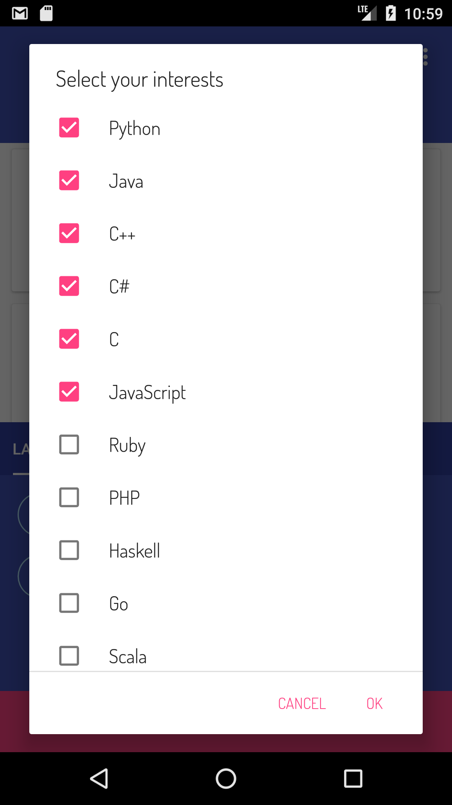

# Trending In Github

## Overview
- Check out the most popular GitHub Repositories along with ‘ Trending In GitHub ’
- 'Trending In GitHub' supports more than 50+ programming languages and you can customize the language filter as you wish.

<a href="https://play.google.com/store/apps/details?id=io.github.stack07142.trendingingithub" > </a>


 
 


## Features
- [x] MVP Pattern
- [x] RxJava + OkHttp + Retrofit
- [x] Android Data binding
- [x] Scrolling techniques
    - [x] Coordinate Layout
    - [X] CollapsingToolbarLayout
- [x] Snack Bar
- [x] RecyclerView
    - [x] Items : Card View
- [x] Floating Action Button
    - [x] Fabulous Filter
- [x] Font
    - [x] TypeKit
    - [x] Dosis by Edgar Tolentino & Pablo Impallari
- [x] Vector Drawable
- [x] Firebase - AdMob


## Used Libraries


## License
```
Copyright 2017 stack.07142

Licensed under the Apache License, Version 2.0 (the "License");
you may not use this file except in compliance with the License.
You may obtain a copy of the License at

    http://www.apache.org/licenses/LICENSE-2.0

Unless required by applicable law or agreed to in writing, software
distributed under the License is distributed on an "AS IS" BASIS,
WITHOUT WARRANTIES OR CONDITIONS OF ANY KIND, either express or implied.
See the License for the specific language governing permissions and
limitations under the License.
```
